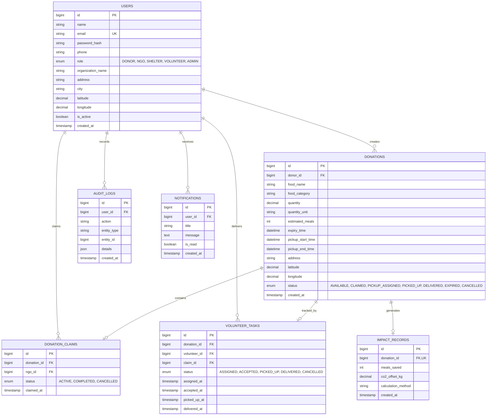

# 🍲 FoodBridge — Surplus Food Recovery & Logistics Platform

[](https://nodejs.org)
[](https://expressjs.com)
[](https://react.dev)
[](https://vitejs.dev)
[](https://www.mysql.com/)
[](LICENSE)

FoodBridge is a full-stack surplus food redistribution network connecting food donors (restaurants, caterers, banquet halls, event organizers) with NGOs, community shelters, and volunteer transport networks to eliminate food waste and fight hunger.

---

## 📌 Problem Statement

Every day, commercial kitchens, restaurants, and event caterers produce millions of tons of fresh, edible surplus food that ends up in landfills, generating harmful methane emissions. Meanwhile, local shelters and vulnerable communities struggle with food scarcity. The core challenge is the **last-mile logistics and coordination gap**:
1. Donors lack a fast, real-time channel to list food with strict expiry windows.
2. NGOs and shelters lack geospatial visibility into nearby available donations.
3. Volunteer dispatching is fragmented and untracked.

---

## 💡 The Solution

**FoodBridge** provides an end-to-end operational platform that digitizes food recovery:
- **Instant Surplus Listing**: Donors post surplus food with portion counts, pickup windows, and handling instructions.
- **Geospatial Discovery & Claiming**: NGOs and shelters discover nearby donations within dynamic radii (1km – 50km) using Haversine-based spatial queries and claim them instantly.
- **Volunteer Task Lifecycle**: Volunteers accept pickup tasks, navigate turn-by-turn routes via Google Maps, confirm handoffs, and record real-time deliveries.
- **Quantified Environmental Impact**: Direct calculation of meals served and CO₂ emissions offset ($2.5\text{ kg CO}_2\text{ per meal saved}$).
- **Role-Based Admin Command Center**: Granular user status management, safe donation lifecycle administration, and immutable audit logs.

---

## 🏗️ System Architecture

```
┌─────────────────────────────────────────────────────────┐
│              React 18 + Vite Single Page App            │
│  (Tailwind CSS, Lucide / Heroicons, Recharts, Context)  │
└────────────────────────────┬────────────────────────────┘
                             │ HTTPS / Axios REST Requests
                             ▼
┌─────────────────────────────────────────────────────────┐
│                Express.js REST API Server               │
│  ┌───────────────────────────────────────────────────┐  │
│  │ Security: Helmet, CORS, Express-Rate-Limit, JWT   │  │
│  ├───────────────────────────────────────────────────┤  │
│  │ Middleware: authMiddleware, authorizeRoles, RBAC  │  │
│  ├───────────────────────────────────────────────────┤  │
│  │ Controllers: Auth, Donations, Tasks, Admin, Stats │  │
│  ├───────────────────────────────────────────────────┤  │
│  │ Services: Geocoding, Donation, Dispatch, Audit    │  │
│  └───────────────────────────────────────────────────┘  │
└──────────────┬───────────────────────────┬──────────────┘
               │ Parameterized SQL Queries │ Geocoding / Routing
               ▼                           ▼
┌──────────────────────────────┐ ┌────────────────────────┐
│      MySQL 8.0 Database      │ │ Google Maps API        │
│  - InnoDB ACID Transactions  │ │ - Geocoding API        │
│  - Spatial & B-Tree Indexes  │ │ - Directions API       │
└──────────────────────────────┘ └────────────────────────┘
```

---

## 🚀 Key Features

### 1. 🍽️ Donor Workflow (Restaurants, Caterers, Banquet Halls)
- **Fast Donation Creation**: Specify food type, quantity, meal count, expiration time, and pickup window.
- **Auto-Geocoding**: Converts street addresses to precise latitude/longitude coordinates via Google Geocoding API.
- **Lifecycle Management**: View, update details, or cancel available listings.
- **Personal Impact Dashboard**: Track total meals provided, delivered donations, and CO₂ offset.

### 2. 🏢 NGO & Shelter Workflow
- **Live Nearby Discovery**: Filter active food supplies within 1, 5, 10, 20, or 50 km radii using Haversine spatial matching.
- **Instant Claiming**: Lock in available donations with database transaction integrity.
- **Volunteer Dispatch**: Assign verified volunteers to claimed pickups.
- **Delivery Confirmation**: Receive notifications upon successful volunteer drop-off.

### 3. 🚴 Volunteer Dispatch & Task Management
- **Task Discovery & Acceptance**: Review pending assignments with pickup/drop-off addresses and emergency contact numbers.
- **Integrated Route Maps**: Visual turn-by-turn navigation between donor kitchen and beneficiary shelter.
- **Status Workflow**: Sequential progression: `ASSIGNED` → `ACCEPTED` → `PICKED_UP` → `DELIVERED`.

### 4. 🛡️ Admin Command Center (`/admin/dashboard`)
- **System Metrics**: Real-time aggregated statistics across users, donations, active workflows, meals saved, and carbon offset.
- **User Management (`/admin/users`)**: Search, filter by role/status, and activate/deactivate accounts with self-deactivation protection.
- **Donation Management (`/admin/donations`)**: Review all historical listings and handle administrative cancellations.
- **Audit Logs (`/admin/audit-logs`)**: Immutable log of administrative actions with timestamp, admin ID, entity ID, and context.
- **Visual Analytics**: Interactive Recharts for monthly recovery trends, status distributions, category shares, and user demographics.

### 5. 🏆 Community Impact & Donor Leaderboard
- **Public Leaderboard (`/leaderboard`)**: Real-time ranking of top contributing donors by total meals saved and carbon offset with podium highlights (🥇, 🥈, 🥉).

---

## 🗄️ Database Schema & Relationships



---

## 🔌 API Endpoints Summary

### Authentication & Profiles (`/api/auth`, `/api/users`)
| Method | Endpoint | Access | Description |
|---|---|---|---|
| `POST` | `/api/auth/register` | Public | Register new donor, NGO, shelter, or volunteer |
| `POST` | `/api/auth/login` | Public | Authenticate user and obtain JWT token |
| `GET` | `/api/auth/me` | Authenticated | Fetch current authenticated user session |
| `GET` | `/api/users/profile` | Authenticated | Get detailed user profile |
| `PUT` | `/api/users/profile` | Authenticated | Update user profile fields (excluding role) |

### Donations (`/api/donations`)
| Method | Endpoint | Access | Description |
|---|---|---|---|
| `POST` | `/api/donations` | `DONOR` | Create a new surplus food donation |
| `GET` | `/api/donations` | Authenticated | List donations (filtered by donor or general) |
| `GET` | `/api/donations/nearby` | `NGO, SHELTER, VOLUNTEER, ADMIN` | Spatial search within radius (km) |
| `GET` | `/api/donations/claims` | `NGO, SHELTER, ADMIN` | List claims made by authenticated NGO |
| `GET` | `/api/donations/:id` | Authenticated | Get full donation details & tracking |
| `POST` | `/api/donations/:id/claim` | `NGO, SHELTER, ADMIN` | Claim an available donation |
| `PUT` | `/api/donations/:id` | `DONOR` | Update details of available donation |
| `DELETE` | `/api/donations/:id` | `DONOR` | Cancel available donation |

### Volunteer Tasks (`/api/tasks`)
| Method | Endpoint | Access | Description |
|---|---|---|---|
| `POST` | `/api/tasks/assign` | `ADMIN, NGO, SHELTER` | Assign volunteer to claimed donation |
| `GET` | `/api/tasks` | `VOLUNTEER` | List assigned tasks |
| `GET` | `/api/tasks/:id` | `VOLUNTEER, ADMIN` | Get task navigation & contact details |
| `POST` | `/api/tasks/:id/accept` | `VOLUNTEER` | Accept assigned task |
| `PUT` | `/api/tasks/:id/pickup` | `VOLUNTEER` | Confirm pickup from donor kitchen |
| `PUT` | `/api/tasks/:id/deliver` | `VOLUNTEER` | Confirm delivery & trigger impact record |

### Analytics & Leaderboard (`/api/analytics`)
| Method | Endpoint | Access | Description |
|---|---|---|---|
| `GET` | `/api/analytics/leaderboard` | Public | Top donors ranked by meals saved & CO₂ offset |
| `GET` | `/api/analytics/overview` | Authenticated | High-level recovery metrics |
| `GET` | `/api/analytics/monthly` | Authenticated | Monthly recovery volume aggregations |
| `GET` | `/api/analytics/categories` | Authenticated | Food category breakdown |
| `GET` | `/api/analytics/status` | Authenticated | Donation status distribution |

### Admin Management (`/api/admin`)
| Method | Endpoint | Access | Description |
|---|---|---|---|
| `GET` | `/api/admin/dashboard` | `ADMIN` | Total users, roles, donations, impact summary |
| `GET` | `/api/admin/analytics` | `ADMIN` | Deep-dive analytics charts data |
| `GET` | `/api/admin/users` | `ADMIN` | Paginated, searchable user directory |
| `PUT` | `/api/admin/users/:id/status` | `ADMIN` | Deactivate/reactivate user with audit log |
| `GET` | `/api/admin/donations` | `ADMIN` | Complete historical donation listings |
| `PUT` | `/api/admin/donations/:id/status` | `ADMIN` | Administrative status update/cancellation |
| `GET` | `/api/admin/audit-logs` | `ADMIN` | Immutable administrative audit trail |

---

## 🔒 Security Architecture

1. **Defense in Depth**: Frontend authorization is purely for UX. Every API endpoint strictly validates JWT authentication and backend role permissions (`authMiddleware`, `authorizeRoles`).
2. **SQL Injection Prevention**: All database interactions use strictly parameterized queries via `mysql2/promise`.
3. **Password Security**: Passwords hashed with `bcryptjs` (salt rounds: 10).
4. **Input Validation**: Request payloads sanitized and validated with `express-validator`.
5. **Admin Self-Protection**: Admins cannot deactivate or delete their own accounts.
6. **Immutable Audit Trails**: Admin actions automatically log timestamp, administrator ID, entity type, previous/new status, and optional reason.
7. **Rate Limiting & Security Headers**: Helmet enabled and API rate limiter active against brute-force attacks.

---

## 🛠️ Tech Stack

| Layer | Technologies |
|---|---|
| **Frontend** | React 18, Vite, React Router v6, Tailwind CSS, Recharts |
| **Backend** | Node.js, Express.js (v5), express-validator, jsonwebtoken, bcryptjs, cors, helmet, morgan |
| **Database** | MySQL 8.0 (InnoDB, ACID compliant, Spatial & B-Tree Indexes) |
| **External APIs** | Google Maps JavaScript API, Google Geocoding API, Google Directions API |
| **Testing** | Node.js Native Test Runner (`node --test`), Supertest |

---

## 📦 Getting Started Locally

### Prerequisites
- **Node.js**: `v20+` or `v22+`
- **MySQL Server**: `v8.0+`
- **npm**: `v10+`

### 1. Clone & Install
```bash
git clone https://github.com/your-username/food-bridge.git
cd food-bridge
npm run install:all
```

### 2. Configure Environment Variables
Create a root `.env` file:
```env
# Server Config
PORT=5000
NODE_ENV=development
JWT_SECRET=super_secure_jwt_secret_foodbridge_2026

# MySQL Database
DB_HOST=localhost
DB_USER=root
DB_PASSWORD=your_mysql_password
DB_NAME=foodbridge
DB_PORT=3306

# Google Maps API Key
GOOGLE_MAPS_API_KEY=AIzaSyYourGoogleMapsApiKey
VITE_GOOGLE_MAPS_API_KEY=AIzaSyYourGoogleMapsApiKey
```

### 3. Initialize & Seed Database
```bash
# Load schema into MySQL
mysql -u root -p < database/schema.sql

# Generate and load 1,000+ realistic donations and community users
node database/seed-generator.js 1000
mysql -u root -p foodbridge < database/seed.sql

# Verify dataset integrity
node database/verify.js
```

### 4. Run Development Environment
```bash
npm run dev
```
- Client runs at: `http://localhost:5173`
- Backend runs at: `http://localhost:5000`

---

## 🧪 Automated Testing

Run the full suite of unit and integration tests:
```bash
npm test --workspace server
```
Tests cover:
- Authentication & JWT token validation
- Role-based authorization & permission walls
- Donation CRUD and status flow constraints
- Spatial Haversine search & radius filtering
- Volunteer assignment, pickup, and delivery
- NGO donation claiming integrity
- Admin dashboard summary aggregations
- Admin user activation/deactivation and self-deactivation protection
- Leaderboard generation

---

## 🚀 Deployment Guide

### Backend (Render, Railway, AWS ECS)
1. Set Environment Variables (`NODE_ENV=production`, `PORT=5000`, `DB_HOST`, `DB_USER`, `DB_PASSWORD`, `DB_NAME`, `JWT_SECRET`, `GOOGLE_MAPS_API_KEY`).
2. Run command: `npm run start --workspace server`.

### Frontend (Vercel, Netlify, Cloudflare Pages)
1. Build command: `npm run build --workspace client`.
2. Output directory: `client/dist`.
3. Set environment variable: `VITE_API_URL=https://api.yourdomain.com/api`.

---

## 📈 Future Improvements
1. **IoT Temperature Monitoring**: Smart sensor integration for perishable cold chain tracking during transit.
2. **AI Meal Matching**: Predictive redistribution matching surplus type with shelter nutritional needs.
3. **Push Notifications**: WebPush / SMS alerts for instant emergency pickups.
# Food-Bridge-court
